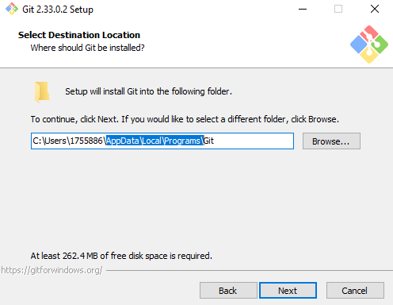
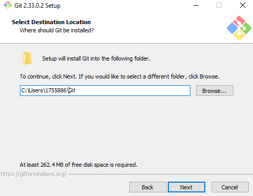
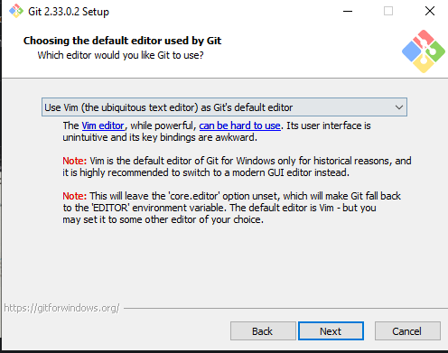
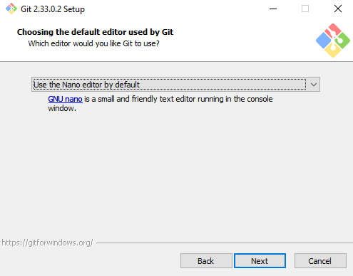
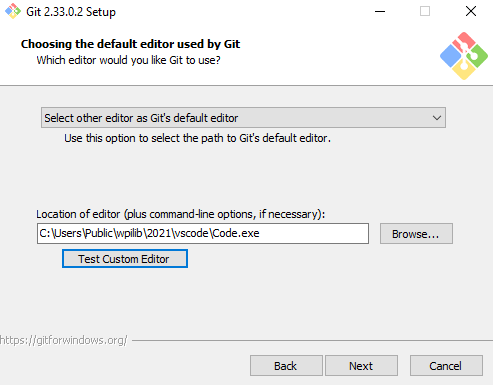
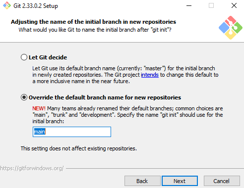
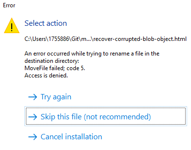

# Software Download Guide

This guide will show you how to download the software necessary to do FRC-related programming.

# Table of Contents
1. [Intro](##Intro)
2. [Java, WPILib, and VSCode](##Installing-Java,-WPILib,-and-VSCode)
3. [Git](#Installing-Git)

## Intro

FRC uses the Java programming language and a library called WPILib (developed at Worcester Polytechnic Institute), as well as a few other external libraries. We also use the Visual Studio Code (VSCode) text editor.

Java, WPILib, and VSCode can all be installed from the same source.

We also use Git to push code to GitHub, which is like a Google Drive for code.

## Installing Java, WPILib, and VSCode:

Follow the instructions from the [WPILib page](https://docs.wpilib.org/en/stable/docs/zero-to-robot/step-2/wpilib-setup.html). [Here](https://github.com/wpilibsuite/allwpilib/releases) is the page where you actually download the package.

When you come to [this image](https://docs.wpilib.org/en/stable/_images/installer-vscode-download.png), select either "Download VSCode for Single Install" or "Download VSCode for Offline Install." If you already have VSCode installed, you can't install WPILib on top of that, unfortunately. You may be able to use a ZIP file of VSCode. See the above WPILib page for more details.

On the page with the checkboxes, select all of the options available.

## Installing Git
Git is what 612 uses to collaborate with code. It allows us to push and pull our code from GitHub so that we all can collaborate.
1. Install git from [here](https://git-scm.com/). On Windows, walk through the installation instructions.
2. **For those on school computers** By default, git will install under the AppData folder, which school computers don't have permission to write to. Change it to a folder that you have access to. It's recommended to simply put it under C:\Users\user\Git, as seen in the image.
    
    Original

        
    
    Edited
    
    

3. When asked which components to install, do not uncheck any of the existing checkboxes. It's also recommended that you add "Check daily for updates." After that, you are free to choose whichever you want.
    

4. When reaching the text editor option:

    

    Do not select the default option of Vim unless you are experienced with it. You likely will not have to use the text editor, but if you do, Vim is extremely difficult to use.
    Instead, you have two options:
    
    First is nano:
    
    
    
    Nano simply uses whichever command line interface (Powershell, etc.) you happen to be using. It's much more intuitive than Vim and doesn't require opening a heavy program.

    Second is VSCode:
    
    
    
    If you select another editor as your editor and paste the path to your VSCode, you can edit git files within VSCode.
    
    ANother option may be Notepad.

5. Git has a name for the default branch. By default, it's "master," but git clients, including GitHub, have changed it to "main." Thus, it's recommended that you select this option below.
    
    

6. **For those on school computers**, during the installation process, there might be a couple of files (usually 2) that cannot be added or moved or modified for some reason. In these cases, these files are simply html (webpage) files for git documentation. Skip these files.
    
    

7. Once you're done installing, launch git bash. You can go to powershell or cmd and run the following commands. You can also run "git bash." Within a folder in Windows Explorer, you can also right click within the folder and type "Git Bash here."
Type the following commands:
    ```bash
    git config --global user.name "Enter your name within these quotes here"
    git config --global user.email "Enter your email within these quotes here."
    ```