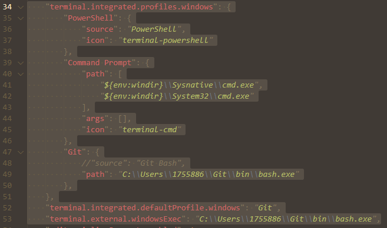
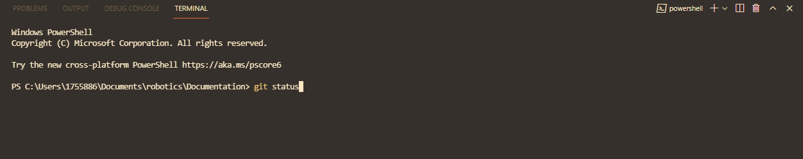
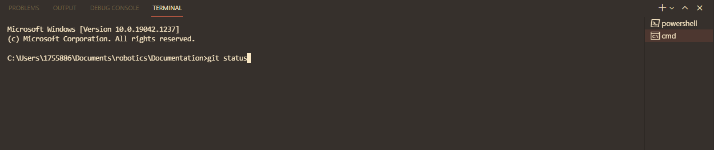

# Software Download Guide

This guide will show you how to download the software necessary to do FRC-related programming.

# Table of Contents
1. [Intro](##Intro)
2. [Java, WPILib, and VSCode](#Installing-Java,-WPILib,-and-VSCode)
3. [Git](#Installing-Git)
    * [Terminal Selection Within VSCode](#Terminal-Selection-Within-VSCode)

## Intro

FRC uses the Java programming language and a library called WPILib (developed at Worcester Polytechnic Institute), as well as a few other external libraries. We also use the Visual Studio Code (VSCode) text editor.

Java, WPILib, and VSCode can all be installed from the same source.

We also use Git to push code to GitHub, which is like a Google Drive for code.

## Installing Java, WPILib, and VSCode:

Follow the **instructions** from the [WPILib page](https://docs.wpilib.org/en/stable/docs/zero-to-robot/step-2/wpilib-setup.html). The page to **download** the installer from is located [here](https://github.com/wpilibsuite/allwpilib/releases).

### Instructions summary:

Once you download the package, run it on Windows 10 by mounting it, as seen below, or unzip using 7Zip:


When you come to [this image](https://docs.wpilib.org/en/stable/_images/installer-vscode-download.png), select either "Download VSCode for Single Install" or "Download VSCode for Offline Install." If you already have VSCode installed, you can't install WPILib on top of that, unfortunately. You may be able to use a ZIP file of VSCode. See the above WPILib page for more details.

On the page "Select the Items You Would Like to Install," all items are needed except for the C++ Compiler.

## Installing Git

Full git usage guide is located [in the git tutorial file](Tutorials/GIT-USAGE-GUIDE.md)

Git is what 612 uses to collaborate with code. It allows us to push and pull our code from GitHub so that we all can collaborate.

1. Install git from [the git website](https://git-scm.com/). On Windows, walk through the installation instructions.

2. **For those on school computers** By default, git will install under the AppData folder, which school computers don't have permission to write to. Change it to a folder that you have access to. It's recommended to simply put it under C:\Users\user\Git, as seen in the image.
    
    Original

        
    
    Edited
    
    

3. When asked which components to install, do not uncheck any of the existing checkboxes. It's also recommended that you add "Check daily for updates." After that, you are free to choose whichever you want.
    
    

4. When reaching the text editor option:

    

    Do not select the default option of Vim unless you are experienced with it. You likely will not have to use the text editor, but if you do, Vim is extremely difficult to use.
    Instead, you have two options:
    
    First is nano:
    
    
    
    Nano simply uses whichever command line interface (Powershell, etc.) you happen to be using. It's much more intuitive than Vim and doesn't require opening a heavy program.

    Second is VSCode:
    
    
    
    If you select another editor as your editor and paste the path to your VSCode, you can edit git files within VSCode.
    
    ANother option may be Notepad.

5. Git has a name for the default branch. By default, it's "master," but git clients, including GitHub, have changed it to "main." Thus, it's recommended that you select this option below.
    
    

6. **For those on school computers**, during the installation process, there might be a couple of files (usually 2) that cannot be added or moved or modified for some reason. In these cases, these files are simply html (webpage) files for git documentation. Skip these files.
    
    

7. Once you're done installing, launch git bash. You can go to powershell or cmd and run the following commands. You can also run "git bash." Within a folder in Windows Explorer, you can also right click within the folder and type "Git Bash here."
Type the following commands:
    ```bash
    git config --global user.name "Enter your name within these quotes here"
    git config --global user.email "Enter your email within these quotes here."
    ```

### Terminal Selection Within VSCode
8. One last step:

    Usage of a terminal is necessary for git. A terminal allows a user to send text commands to make the computer do particular actions. That is exactly how Git works: users enter text commands in order to push/pull code. For example, in the terminal, they can enter the command "git status" to get the status of all of their files.

    VSCode has a feature that allows users to access a terminal without opening a new window. One can press Ctrl + Shift + `, or they can go to the "Terminal" menu and select "New Terminal."

    1. Press ```Ctrl + ,``` to access Settings.
    2. On the top right corner, press the icon to the left of the WPILib logo to open the settings.json file.
    3. Try to find the text ```"terminal.integrated.profiles.windows"``` by pressing ```Ctrl + F``` (it might be at the very bottom).   
        1. Replace that entire section so that it resembles the following:

        ```JSON
        "terminal.integrated.profiles.windows": {
            "PowerShell": {
                "source": "PowerShell",
                "icon": "terminal-powershell"
            },
            "Command Prompt": {
                "path": [
                    "${env:windir}\\Sysnative\\cmd.exe",
                    "${env:windir}\\System32\\cmd.exe"
                ],
                "args": [],
                "icon": "terminal-cmd"
            },
            "Git": {
                //"source": "Git Bash",
                "path": "[insert path to Git\\bin\\bash]"

                //On personal computers, it's usually in the ProgramFiles directory. 
                //School computers, it's wherever you installed it to.
            },
        },
        "terminal.integrated.defaultProfile.windows": "[choose a profile here]" //add comma here if there's some more stuff on the bottom
        ```

        For example:

        

        You can choose a default terminal. PowerShell and Command Prompt (CMD) are Windows defaults, but Git Bash may be easier as it states which branch you are on.

        #### Visual Differences between PowerShell, Command Prompt, and Git Bash:

        Git Bash:
        

        PowerShell:
        

        CMD
        