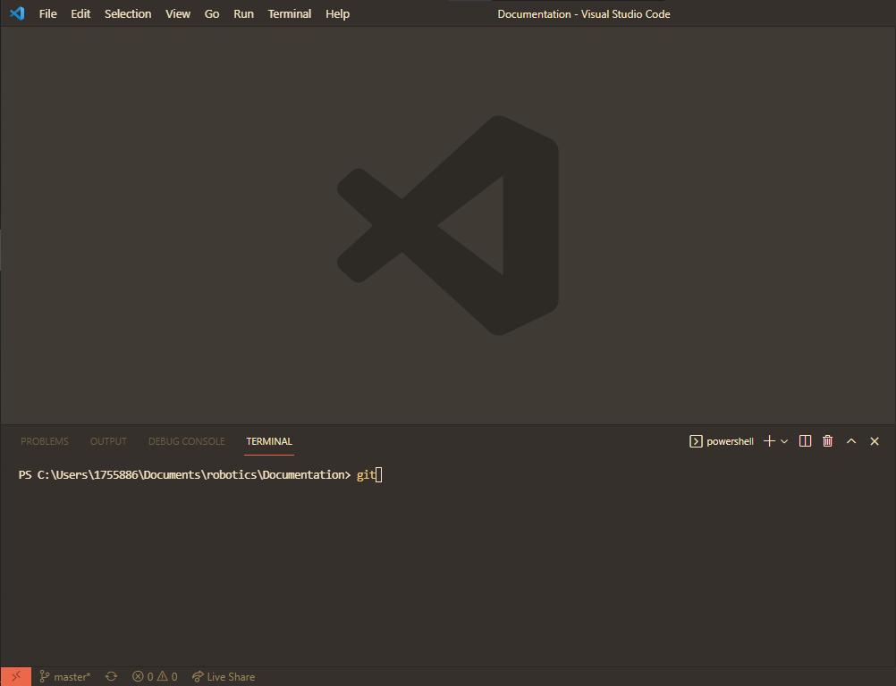
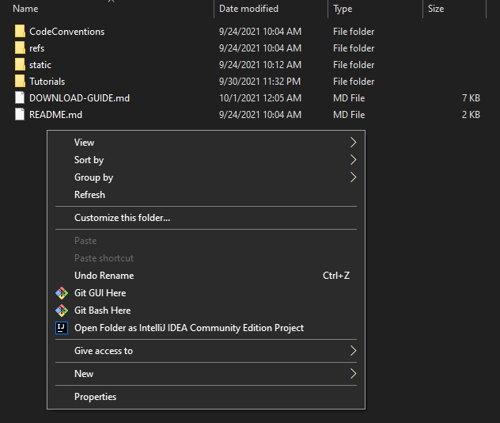

# Guide to using git, git bash, and GitHub while FRC programming

Download guide is located [here](../DOWNLOAD-GUIDE.md#Installing-Git)

## Table of contents
* [Opening git bash](#Opening-git-bash)
* [Cloning a repository](#To-clone-a-repository)
* [Pushing code to GitHub](#To-push-code-to-GitHub)
* [External Resources](#External-Resources)

## Opening git bash
1. You have two options to open git bash:
    * (Recommended) Opening a terminal within VSCode. See [this guide to VSCode terminals for more details](../DOWNLOAD-GUIDE.md#Terminal-Selection-Within-VSCode)
    

    * Opening Windows File Explorer, going to the folder where your code and git repository is located, right clicking on some blank space, and clicking "Git Bash Here," as seen in the below image
    

## To clone a repository <a name="To-clone-a-repository"></a>
Often used to create code from a template
1. Go to the GitHub repo and select the "Clone" button.
2. Click the copy button to copy the link.
3. Open the terminal/command line from VSCode (press CTRL + ~), or go to the folder in Windows Explorer and right-click, and then click "git bash here" in the menu.
4. Type ```git clone [url] <folder name>.``` (Brackets are mandatory, the other things are optional.)
5. Switch [branches](https://docs.github.com/en/github/collaborating-with-pull-requests/proposing-changes-to-your-work-with-pull-requests/about-branches) if need be. This must be done if you are currently done on the *main* or *master* branch. 
    * If you want to switch to an existing branch, type ```git checkout [branch name]```.
    * If you want to create a new brach, type ```git checkout -b [new branch name]```.
    * Branches are usually created if you are working on a particular feature. For example, if you are coding the climb system, you would create a climb branch, and that would eventually be pulled into the main/master branch.
    * [Further explanation of branches (Nick White video)](https://youtu.be/mJ-qvsxPHpY?t=681)
5. Success! Start coding.

## To push code to GitHub. <a name="To-push-code-to-GitHub"></a>

1. Repeat step 3 above.
2. Type ```git add -A```
* ```git add -A``` adds all changes within the git repository. In the rare instance that you do not want to do that, you may need to use a different command. See [this video](https://www.youtube.com/watch?v=tcd4txbTtAY) for more details.
3. Type ```git commit -m "[message]"```
    - (Alternatively, you can use ```git commit -am "[message]"``` to combine steps 2 and 3)
4. (Usually required but sometimes optional)
5. Double-check that you are on the right branch. If not, follow step 5 under [Cloning a repository](#To-clone-a-repository). **Please do not push to main or master unless needed.**
6. Type ```git push origin [branch name]```.
7. Success! Along the way, it's good practice to type ```git status``` just in case.

## Issues and Pull Requests

 [Issues](https://guides.github.com/features/issues/) simply serve as a checklist for what needs to be fixed or added. They're a handy way to have all tasks in one place, and they allow programmers to claim an issue and work on it. 
 
 To add an issue, go to the repository, click "Issues," and select "Create New Issue." You can assign yourself and other people to that issue. Visual instructions coming soon.

[Pull Requests](https://docs.github.com/en/github/collaborating-with-pull-requests/proposing-changes-to-your-work-with-pull-requests/creating-a-pull-request) are a way to review changes before committing code, cleaning up code and preventing bugs from getting into the final code. One can mention an issue within a pull request, linking an issue with a potential solution.

To create a pull request (visual instructions coming soon, see [here](https://youtu.be/mJ-qvsxPHpY?t=873)):
1. If you just committed code to a branch, you'll see a yellow bar at the top with the button "Compare and Create Pull Request." Press that button if so. If not, click the button that says "[x] branches." Find your branch and select "create pull request."
2. Mention the issue you want to fix. For example, if there's an issue titled "Create Climb," and it's been assigned issue #4, then in the comments, type "#4" with a description of what you have done. You can assign others code review.

The handy thing about Issues and Pull Requests is that they can be linked with a Trello card. More on that will come soon.

## External Resources <a name="External-Resources"></a>

* [*Git Tutorial for Dummies* by Nick White (video)](https://youtu.be/mJ-qvsxPHpY)
    * Clearly explains the purpose of git, and explains how to make pull requests from branches.
* [*GitHub Proposing Changes Documentation* (website)](https://docs.github.com/en/github/collaborating-with-pull-requests/proposing-changes-to-your-work-with-pull-requests)
    * Most important:
        * [About branches](https://docs.github.com/en/github/collaborating-with-pull-requests/proposing-changes-to-your-work-with-pull-requests/about-branches)
        * [About Pull Requests](https://docs.github.com/en/github/collaborating-with-pull-requests/proposing-changes-to-your-work-with-pull-requests/about-pull-requests)
        * [Creating a Pull Request](https://docs.github.com/en/github/collaborating-with-pull-requests/proposing-changes-to-your-work-with-pull-requests/creating-a-pull-request)
* [*Git Tutorial: Difference between "add -A", "add -u", "add .", and "add \*"* (video)](https://www.youtube.com/watch?v=tcd4txbTtAY)