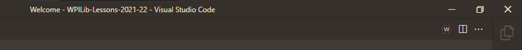
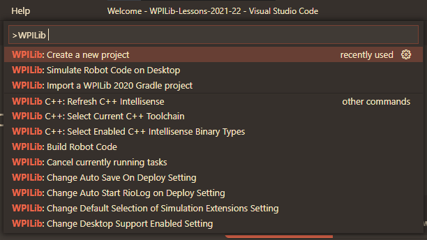
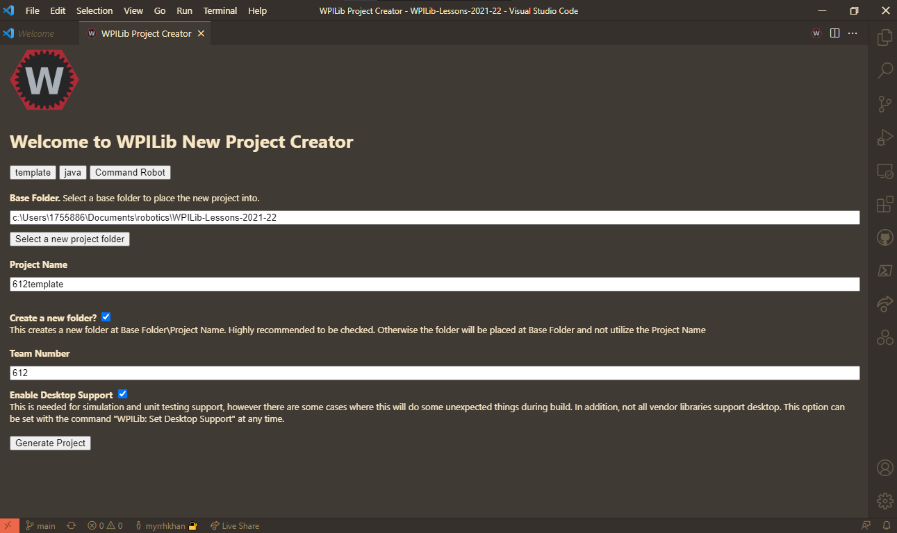

# WPILib Tutorial

## Table of Contents
* [Intro](#Intro)
* [Creating a WPILib Project](#Creating-a-WPILib-Project)

## Intro

WPILib is the framework by which we program our robot. It allows us to set up a template for robot code very easily.
To install WPILib, see [the download guide](../DOWNLOAD-GUIDE.md).

During build season, you'll mainly be cloning the existing code on GitHub and working on that, rather than creating a project from scratch. However, it is still important to create a project from scratch to work with the Romis, etc.

## Creating a WPILib Project

1. Click the WPILib icon on the top right corner, as seen in the first image below, or press ```Ctrl + Shift + P``` to open up the Command Palette. Then type "Create New Project," as seen in the second image.

    The WPILib button on the right edge, which opens up WPILib- specific commands in the Command Palette.
    
    
    Selecting the command.

    

2. In the WPILib creation screen, select the options so that you get the screen below. The only things that don't stay the same are the project name and the folder, as well as the "Command Robot" section if you're working with Romis.

    
    (With regards to the base folder, you may choose whichever folder you want. One handy tip is to have a folder somewhere on your computer for robotics-related code.)
